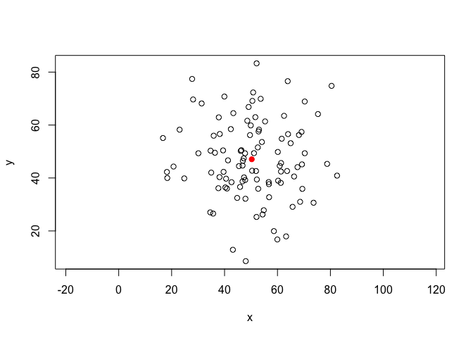
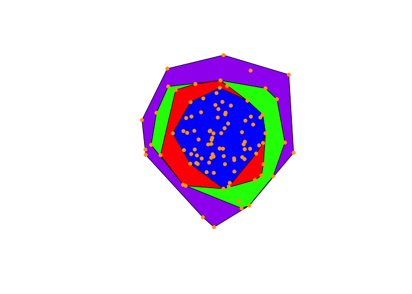
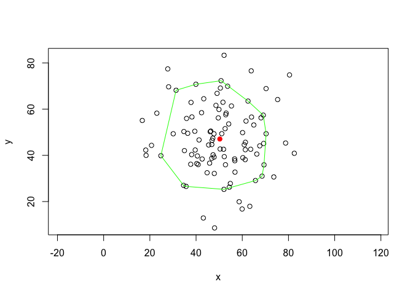

I've been spending a lot of time over the last several months thinking about animal home ranges, utilization distributions, and movement ecology. All this thinking has gone into a shiny application for the exploratory analysis and visualization of animal movement data. Estimating the home ranges is fairly straight forward. The stumbling block is working with the classes in `adehabitatHR`, `adehabitatLT`, and `sp` R packages and mapping those ranges on an interactive leaflet map. I'll review different methods of estimating home ranges in several other posts. My main motivation is to better understand the underlying theory of home range estimation by digging into the code.

## Minimum Convex Polygon

Potentiall the easiest methods of estimating home ranges is the Minimum Convex Polygon. The concept is to construct the smallest possible convex polygon around the XY locations (point set). MCP has several downsides, however they are good for exploratory analysis and visualization. The steps to calculate a MCP are as follows.

1. Calculate the centroid of all the points
2. Calculate the distances from the centroid to all the points
3. Remove all points with a distance greater than a selected quantile
4. Use a convex hull algorithm to estimate the minimum convex polygon

## Data

These days the data will be geographic coordinates collected from a telemetry system, either VHF or GPS. The data doesn't need to have a timestamp. Other potential data sources can be from foot prints in snow, scat, hair traps, etc. As long as there are X and Y coordinates. For any data sources it is best to be able to identify individuals. VHF data should have a date and GPS data should be timestamped. This type of data is good for minimum convex polygon, kernel density, and brownian bridge methods. Below I generate a random point set (ignore the red dot for now).

```r
install.packages(c()'adehabitatHR', 'sp'))
library(adehabitatHR)    #loads sp package
## creating data
x <- rnorm(100, mean = 50, sd = 15)
y <- rnorm(100, mean = 50, sd = 15)
xy <- data.frame(x, y, 'id' = rep('a', 100))
plot(x, y, asp = 1)
```



<figcaption>Plot of randomly generated data for MCP home range estimation</figcaption>

## MCP with `adehabitatHR`

Below is an example to estimate an minimum convex polygon with the randomly generated point set above. To use `adehabitatHR` the data must be of class `sp::SpatialPointsDataFrame`, and the dataframe must have a column with the ID of each individual (if there are multiple individuals). The first line is one of many ways to create a SpatialPointsDataFrame with your data. The following lines estimate the MCP with the `adehabitatHR::mcp` function and plot the result.

``` r
coordinates(xy) <- xy[, c('x', 'y')]

mcp_est100 <- mcp(xy[, 3], percent = 100)
mcp_est90 <- mcp(xy[, 3], percent = 90)
mcp_est80 <- mcp(xy[, 3], percent = 80)
mcp_est70 <- mcp(xy[, 3], percent = 70)

plot(mcp_est100, col = 'purple')
plot(mcp_est90, add = TRUE, col = 'green')
plot(mcp_est80, add = TRUE, col = 'red')
plot(mcp_est70, add = TRUE, col = 'blue')
plot(xy, cex = .75, pch = 19, col = 'orange', add = TRUE)
```



<figcaption>Multiple MCPs with the original data points plotted. Purpe =  100%, green = 90%, red = 80%, blue = 70%. As you can see, each polygon encompasses fewer and fewer points. Because our data has 100 points each polygon encompasses 100, 90, 80, 70 points respectively.</figcaption>

## Manually Estimating an MCP

To dig a little deeper into the method of constructing MCPs I looked under the hood at the source code for the function. I was curious about the nitty gritty of the method, and to see if there was an easier way plot the polygons on a leaflet map.

### Step 1, 2, and 3

Calculate the centroid of all the points, and the distance from each point to the centroid. For simplicity, recreate the xy dataframe with the x and y vector. The last chunk of code (under percentages) is used to exclude all the points from the original dataframe that are greater than which ever quantile you've selected, 80% in this case.

``` r
xy <- data.frame(x, y, 'id' = rep('a', 100))
centroid <- apply(xy[, 1:2], 2, mean)

# if you want to visualize the centroid, the red dot
# I told you to ignore in the first figure.
plot(x, y, asp = 1)
points(centroid[1], centroid[2], pch = 19, col = 'red')

# percentages
d <- sqrt(((xy[, 1] - centroid[1])^2) + ((xy[, 2] - centroid[2])^2))
indx <- 1:length(d)
pct <- indx[d <= quantile(d, .8)]
mcp.pts <- xy[pct, ]
```

### Step 4

The `mcp.pts` dataframe is ready for the convex hull algorithm [There are many](http://geomalgorithms.com/a10-_hull-1.html) different convex hull algorithms to estimate the minimum convex polygon. I'm sure any computational geometry textbook or website will have a complete explanation of the different implementations of these algorithms. The R function `chull` will estimate the MCP. The algorithm this function uses is from [Eddy 1977](https://www.cs.swarthmore.edu/~adanner/cs97/s08/pdf/ANewConvexHull.pdf) (link to PDF, may auto download on some browsers). There may be quicker or more extensible algorithms (3 dimensions), however that is beyond the scope of this post.

The first line below does the work, estimating the points that are the vertexes of the MCP polygon. The two following lines are extracting those points then duplicating the first point as the last point to close the polygon.

``` r
brdr <- chull(mcp.pts[, 1], mcp.pts[, 2])
xy.brdr <- mcp.pts[brdr, ]
xy.brdr <- rbind(xy.brdr[nrow(xy.brdr), ], xy.brdr)

# add mcp to plot
plot(x, y, asp = 1)
points(centroid[1], centroid[2], pch = 19, col = 'red')
lines(xy.brdr[, 1], xy.brdr[, 2], col = 'green')
```



<figcaption>Manually estimated MCP. Green polygon = 80% MCP and the red point is the centroid The green polygon above is the same as the red polygon in the example with multiple MCP estimates.</figcaption>