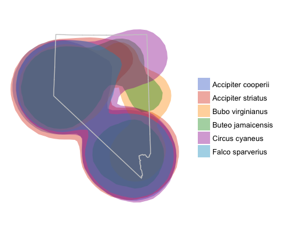
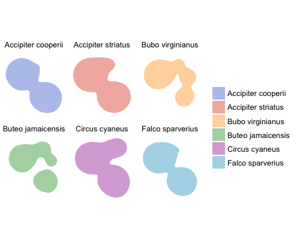
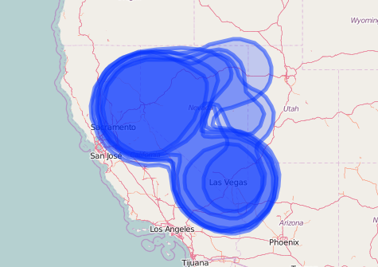

`adehabitatHR` is a must use package for spatial ecology analysis. I use it all the time to create home ranges and utilization distributions (and that is about it, I know there is a lot more that can be done). Many of the classes in `adehabitatHR` inherit or extend `sp` classes. This is great as all the visualization functions from `sp` are available. However, I never took the time to really learn base graphics. I use `ggplot2` and `leaflet` instead. Of course there are trade-offs, and the discussion of the [benefits/pitfalls](https://flowingdata.com/2016/03/22/comparing-ggplot2-and-r-base-graphics/) for each will continue *ad infinitum*. In this post I'll cover several methods for displaying `adehabitatHR` objects in `ggplot2` and `leaflet`.

## Workspace and data

Load the required packages. Be careful when using `adehabitatHR` and `dplyr`, some functions are masked (`select`, `id`) depending on which is loaded first. I tend to load `dplyr` first because it is easier to remember to call its functions with `dplyr::`.

The point data was gathered using the `rebird` [package](https://ropensci.org/tutorials/rebird_tutorial.html) to get bird observations in Nevada. [Download the data](https://github.com/mgritts/mgritts.github.io/tree/master/_data). Don't forget the .rda file for the outline of Nevada, it'll give a better spatial context for the point data and polygons we will create.

I wrote the `xyConv` a while back to help me more easily convert between longlat and UTM coordinate systems. It will remove records where there aren't coordinates (`sp::spTransform` throws errors if coordinates are blank).

```r
library(dplyr)
library(adehabitatHR)
library(ggplot2)
library(magrittr)
library(leaflet)

xyConv <- function(df, xy = c('long_x', 'lat_y'), CRSin = '+proj=longlat',
                   CRSout = '+proj=utm +zone=11') {
  df <- df[complete.cases(df[, xy]), ]
  conv <- SpatialPoints(cbind('x' = df[, xy[1]],
                              'y' = df[, xy[2]]),
                        proj4string = CRS(CRSin))
  conv <- spTransform(conv, CRS(CRSout))
  conv <- data.frame(conv)
  colnames(conv) <- c('x', 'y')
  df <- cbind(df, conv)
  return(df)
}  

# convert and only include points with enough observations
dat <- read.csv('ebird.csv')
splst <- dat %>% group_by(sciName) %>% summarize(n = n()) %>% arrange(n) %>%
  filter(n > 30) %>% dplyr::select(sciName) %>% extract2(1) %>% as.character()
dat <- dat %>% filter(sciName %in% splst) %>% droplevels()

nv <- readRDS('NV_outline.rda')
nv <- fortify(nv)

# quick plot of the points
plot(dat$x, dat$y, asp = 1)
```

The next step is to convert the data to a `SpatialPointsDataFrame`. I've found the following to be the easiest way to do that. If you're unfamiliar with the `sp` package this [cheatsheet](http://www.maths.lancs.ac.uk/~rowlings/Teaching/UseR2012/cheatsheet.html) will be helpful.

```r
prj <- '+init=epsg:26911'
spdf <- SpatialPointsDataFrame(coordinates(cbind(dat$x, dat$y)),
                               data = dat, proj4string = CRS(prj))
# another quick plot
plot(spdf, pch = 19, cex = .5)
```

## Estimating Kernel Density

With the data in the proper format estimating a kernel density utilization distribution is fairly easy with the `kernelUD` function. `kernelUD` has several options for bandwidth estimation, etc. However I generally only supply the SpatialPointsDataFrame.

```r
kd <- kernelUD(spdf[, 4])
image(kd)
plot(getverticeshr(kd, percent = 75), add = TRUE)

ud <- getverticeshr(kd, percent = 90)
class(ud)
plot(ud)
```

Mostly simple! A little explanation on the xy argument from `kernelUD`, it must be either a `SpatialPoints` or `SpatialPointsDataFrame`. For the latter, you must specify the column of the dataframe to corresponding to the ID or factor to create the kernel density estimations. Type `spdf[, 4]` to see what is printed. It'll help make sense of this call. The `getverticeshr` call returns a `SpatialPolygonsDataFrame` with the selected percent contour (in our case 90% contour). We are still using base R graphics, it'll get better soon.

Estimating the kernel density for each species in the dataframe will be a little more informative. Unfortunately `getverticeshr` only works on one object at a time. To visualize each species' kernel density utilization you must subset the list of utilization distributions. Alternatively, we can iterate over the list and create a `SpatialPolygonsDataFrame` with all the species contours.

```r
kd <- kernelUD(spdf[, 7])
image(kd)
# visualize individual utilization distribution
image(kd[[1]])
plot(getverticeshr(kd[[1]], 95), add = TRUE)

# creating SpatialPolygonsDataFrame
kd_names <- names(kd)
ud <- lapply(kd, function(x), try(getverticeshr(x, 95)))
# changing each polygons id to the species name for rbind call
sapply(1:length(ud), function(i) {
  row.names(ud[[i]]) <<- kd_names[i]
})
sdf_poly <- Reduce(rbind, ud)
plot(sdf_poly)
```

As with `SpatialPointsDataFrame`, creating `SpatialPolygonsDataFrame` can be a pain. The `lapply` call returns a list of `SpatialPolygonsDataFrames`. We can use `rbind` to merge them into one, but the IDs need to be unique. Check the ID of any polygon in the list with `row.names(ud[[1]])`. We change the IDs (`sapply` call), then use `Reduce(rbind, ud)` to bind the polygons into one `SpatialPolygonsDataFrame`. Note, `<<-` is used to reference the `ud` object in the global environment.

## Visualizing with ggplot

In the ggplot2 wiki there is an article about [plotting polygon shapefiles](https://github.com/hadley/ggplot2/wiki/plotting-polygon-shapefiles). `ggplot2::fortify` is a function that magically converts spatial polygons into a dataframe. It takes the `SpatialPolygonsDataFrame` and converts it to a standard dataframe.

```r
df <- fortify(sdf_poly)
g <- ggplot(df, aes(x = long, y = lat, fill = id, group = group)) +
            geom_polygon(alpha = .4) +
            ggthemes::scale_fill_gdocs() +
            coord_equal() +
            theme_void()
g
g + facet_wrap(~id)
```


*ggplot map with overlayed utilization distributions and Nevada outline.*


*kernel density utilization distributions faceted by species.*

By now it is fairly obvious how poor this example dataset is; the utilization distributions are severely overlapping, but I think the method is clear.

## Visualizing in Leaflet

Leaflet is great for interactive plots. I really like using leaflet because basemaps are a given in all visualizations. It is easy to create new layers with different data sources, add colors, and legends. There is a little nuance in how to add layers depending on the class of the data to map. However leaflet is extremely flexible and can map dataframes, sp classes, and geojson. Perhaps the easiest method (and the methods outlined in the [leaflet documentation](https://rstudio.github.io/leaflet/)) is to use `sp` objects.

```r
# first convert to longitude and latitude
sdf_poly <- spTransform(sdf_poly, CRS('+init=epsg:4326'))
leaflet(sdf_poly) %>% addTiles() %>%
  addPolygons()

# adding colors and legends
sdf_poly$id <- kd_names
fct <- factor(kd_names)
pal <- colorFactor(ggthemes::gdocs_pal()(5), kd_names)
leaflet(sdf_poly) %>% addTiles() %>%
  addPolygons(weight = 1, fillOpacity = .2, color = ~pal(id)) %>%
  addLegend('bottomleft', pal = pal, values = ~id, title = 'Species')
```


*Leaflet map of kernel density distributions without specifying any additional map options*


*Leaflet map with kernel density, colored by species with a legend. I've also changed the stroke weight and fill opacity.*

Again, pretty simple! Specifying the color palette is a little difficult/takes some getting used to, however the method is similar for changing other variables such as marker type, marker size, fillOpacity, etc.

I find using ggplot2 and leaflet to be much more flexible than base graphics when it comes to mapping data. There are extensions for ggplot2 that grabs basemaps from google maps or Open Street Maps.

A note on the size of the KDE. Due to the large area the observations are spread in the dataset the resulting KDE are very large. A better method may be to create a new ID field to use for the estimation of the kernel density. For instance, a combination of species name and county will estimate county wide kernel densities for each species.
